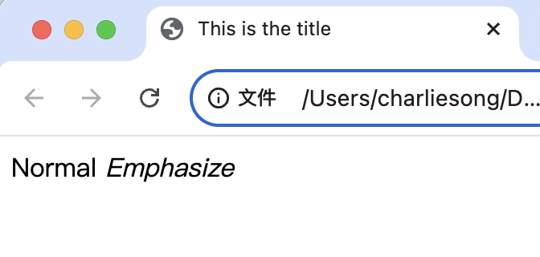
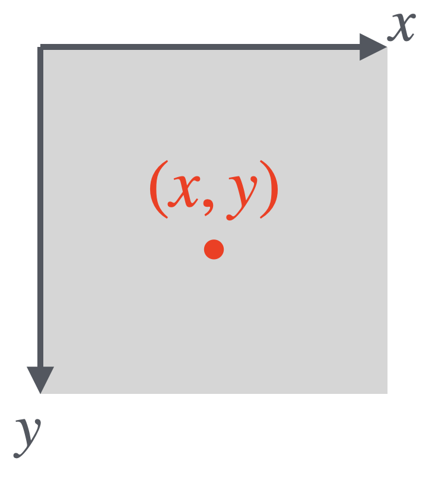
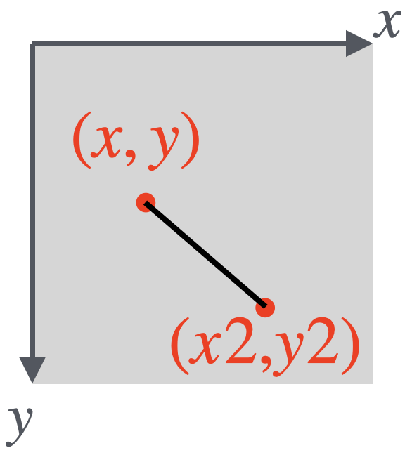
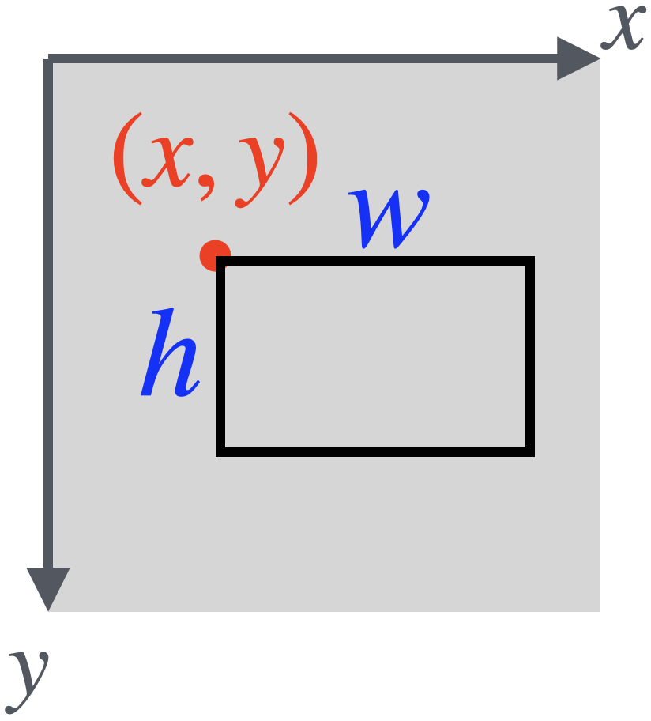
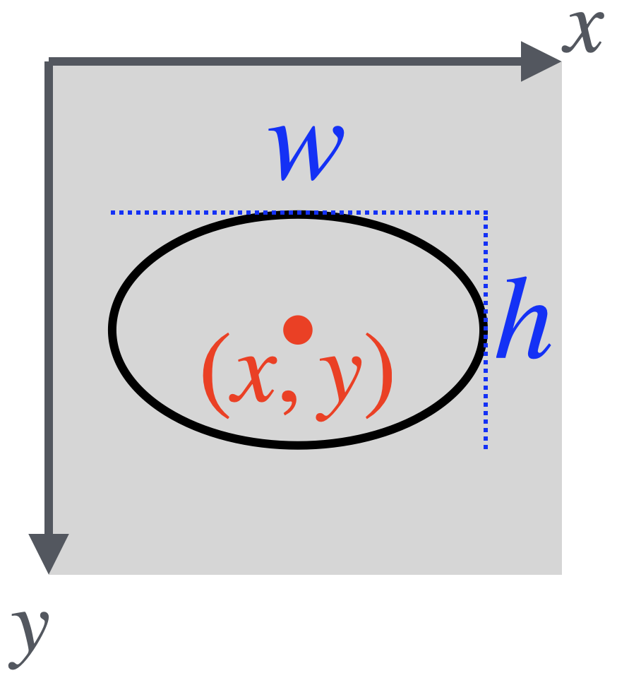

# ***Workshop 1***

---

## **Introduction**

### **HTML** (Hyper-Text Markup Language 超文本标记语言)

​			Web browsers use to display content.

​			Just a text document

### HTML **tags** 

​			e.g. \<html\> \</html\>

​			Tells how to **structure** and **display** a web page.

### **p5.js**

​			A **JavaScript** version of the Java-based **Processing** language and platform for **Creative Coding** in Art and Design				

---

## **HTML**

### Basic structure:

```html
<html> <!-- Open Tag -->
  Hello World! <!-- Content -->
</html> <!-- Close Tag --> 
```

	### Code:

```html
<html>
	<head>
		<title>This is the title</title> <!-- title: Set the website title -->
	</head>
  
	<body>
		Normal <em>Emphasize</em> <!-- em: emphasize the text -->
	</body>
</html>
```

### Result:



---

## **p5.js**

### Basic structure

```javascript
function setup() { // Run once at the beginning.
  createCanvas(600, 600);
  frameRate(10); // 10 Frames per sec.
  ...
}

function draw() { // Run on every Frame.
  ...
}
```

- **createCanvas($w$, $h$)** : Create a new canvas

​				**[parenthesis] **	width: $w$ 		height: $h$


### Draw something

| Code                        | Function            | Parenthesis(参数)                                           | Result                                                      |
| :-------------------------- | ------------------- | ----------------------------------------------------------- | ----------------------------------------------------------- |
| point($x$, $y$)             | Draw a point        | position: $(x,y)$                                           |  |
| line($x$, $y$, $x2$, $y2$)  | Draw a line         | position: $(x,y)$ to $(x2,y2)$                              |  |
| rect($x$, $y$, $w$, $h$)    | Draw a rectangle    | top-left position: $(x,y)$<br />width: $w$<br />height: $h$ |  |
| ellipse($x$, $y$, $w$, $h$) | Draw a ellipse/oval | center position: $(x,y)$<br />width: $w$<br />height: $h$   |  |


### Colors

​	**\<colorValue\>:**

- ($gray$) : **gray-degree**. _(from 0-255)_
- ($gray$, a) : **gray-degree**, **alpha**. _(all from 0-255)_
- ($r$, $g$, $b$) : **red**, **green**, **blue**. _(all from 0-255)_
- ($r$, $g$, $b$, $a$) :  **red**, **green**, **blue**, **alpha**. _(all from 0-255)_

​			***alpha** is the degree of transparent.

​	**Setting Styles:**

- **noStroke**:  Without strokes
- **stroke(\<colorValue\>)** : Set stroke color
- **strokeWight($w$)** : Set stroke wight to $w$
- **noFill**:  Without fill
- **fill(\<colorValue\>)** : Set fill color
- **background(\<colorValue\>)** : Fill the entire canvas background

### Variables

​	<u>*containers that hold information*</u>

- **var x = 10** : Create a new variable "x", and set its value to 10
- **x = x + 3** : Add variable "x" value by 3

​	**System Variables:**

- **mouseX, mouseY**: x/y position of mouse.
- **random($a$, $b$)**: a random value between $a$ and $b$
- **random($b$)**: a random value between $0$ and $b$